### Nombre: Francisco Hermani

### Padrón: 98223

Link GitHub: https://github.com/franhermani/taller-tp0

#### Paso 0: Entorno de trabajo

#### a)
Ejecución del aplicativo sin Valgrind

Ejecución del aplicativo con Valgrind

#### b)

Valgrind es una herramienta que permite debuggear y detectar
pérdidas y errores de memoria en un programa dado, tales como:
- Escritura en memoria de sólo lectura o ya liberada
- Uso de memoria no inicializada
- Leaks de memoria

Sus opciones más comunes son *Memcheck*, *Addrcheck* y *Helgrind*.

#### c)

El operador *sizeof()* representa el espacio en bytes que
ocupa en memoria el tipo de dato recibido por parámetro.

El valor de salida de *sizeof(char)* será de 1 byte,
mientras que el de *sizeof(int)* será de 4 bytes.

#### d)

El *sizeof()* de un struct de C es mayor o igual a la suma
del *sizeof()* de cada uno de sus elementos.

Asumiendo que estamos trabajando en una arquitectura cuya
alineación en memoria es de N bytes, la igualdad se logrará
siempre y cuando la suma de los *sizeof()* de los elementos
del struct sea un valor múltiplo de N bytes.

En cualquier otro caso, el *sizeof()* del struct
será mayor al de la suma de sus elementos.

Por ejemplo, si estamos trabajando en una arquitectura que alinea
a 4 bytes y tenemos un struct A con 4 atributos tipo *char*,
entonces se dará la igualdad. En este caso,
*sizeof(A) = 4 * sizeof(char) = 4*

En cambio, si tenemos un struct B con un elemento tipo *char*
y otro tipo *int*, entonces no se dará la igualdad, ya que
el compilador aplicará padding para lograr la alineación mencionada.
En este caso *sizeof(B) = sizeof(char) + 3 bytes de padding
+ sizeof(int) = 1 + 3 + 4 = 8*, mientras que la suma de los *sizeof()*
de sus elementos es *sizeof(char) + sizeof(int) = 1 + 4 = 5*

#### e)

A continuación, se detallan los archivos estándar:

- STDIN (*Standard Input*). Entrada estándar del programa. Para redirigir
la entrada a un archivo de texto plano, utilizar la sintaxis *./tp < archivo*
- STDOUT (*Standard Output*). Salida estándar del programa. Para redirigir
la salida a un archivo de texto plano, utilizar la sintaxis *./tp > archivo*
- STDERR (*Standard Error*). Salida estándar de los errores del programa.
La redirección funciona igual que en STDOUT

Por otro lado, para conectar la salida estándar de un *programa1*
con la entrada estándar de un *programa2*, utilizar la sintaxis
*programa1 | programa2*

#### Paso 1: SERCOM - Errores de generación y normas de programación

#### a)

Los problemas de estilo detectados por el SERCOM son los siguientes:

A continuación, se detalla cada uno:

Archivo *paso1_wordscounter.c*
- Línea 27. Falta un espacio entre el *while* y el paréntesis de la condición
- Línea 41. No coincide la cantidad de espacios al inicio y al final
de la condición del *if*. Se tienen 2 y 0 espacios, respectivamente.
- Línea 41. La cantidad de espacios al inicio y al final del *if*
no es correcta. Deberían ser 0 ó 1, y se tienen 2 al inicio y 0 al final.
- Línea 47. El *else* no está en la misma línea que la llave que cierra el *if*
- Línea 47. Las llaves del *else* no están en la misma línea (es decir,
la que cierra el *if* anterior y la que da comienzo al mismo *else*)
- Línea 48. Falta un espacio entre el *if* y el paréntesis de la condición
- Línea 53. Sobra un espacio entre el valor de retorno y el carácter ";"

Archivo *paso1_main.c*
- Línea 12. En general, se recomienda el uso de la función *snprintf()*
por sobre *strcpy()*. Esto es así ya que es más robusto y limita la cantidad
de caracteres a leer, lo cual evita posibles *buffer overflows*.
- Línea 15. El *else* no está en la misma línea que la llave que cierra el *if*
- Línea 15. Las llaves del *else* no están en la misma línea (es decir,
la que cierra el *if* anterior y la que da comienzo al mismo *else*)

Archivo *paso1_wordscounter.h*
- Línea 5. La línea supera la cantidad de caracteres máxima recomendada
por línea de código (83 > 80)

#### b)

Los errores de generación del ejecutable detectados por el SERCOM
son los siguientes:

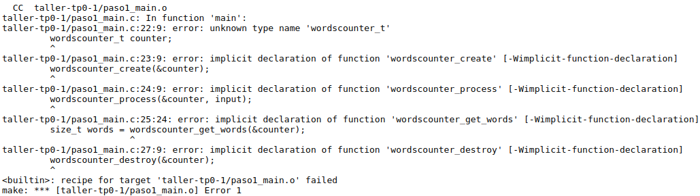

A continuación, se detalla cada uno:

Archivo *paso1_main.c*

- Línea 22. Tipo desconocido *wordscounter_t*. Ocurre porque no se incluyó
el archivo *paso1_wordscounter.h*, en el cual se define el tipo mencionado
- Línea 23. Declaración implícita de la función *wordscounter_create*.
Ocurre porque no se incluyó el archivo *paso1_wordscounter.h*, en el cual
se declara dicha función
- Línea 24. Declaración implícita de la función *wordscounter_process*.
Ocurre por el mismo motivo que el punto anterior
- Línea 25. Declaración implícita de la función *wordscounter_get_words*.
Ocurre por el mismo motivo que el punto anterior
- Línea 27. Declaración implícita de la función *wordscounter_destroy*.
Ocurre por el mismo motivo que el punto anterior

Todos los errores mencionados pertenecen a la etapa de compilación.

#### c)

El sistema no reportó ningún *warning*. Esto se debe a que el SERCOM compila
con el flag *-Werror*, el cual implica que todos los *warnings* se traten
como *errores*.

#### Paso 2: SERCOM - Errores de generación 2

#### a)

Respecto de la versión anterior, se realizaron las siguientes correcciones:

- Se incluyó el archivo *paso2_wordscounter.h*. Esto soluciona el error de
las declaraciones implícitas y del tipo desconocido.
- Se reemplazó la función *strcpy()* por *memcpy()*, la cual indica
la cantidad de caracteres a leer
- Se colocaron las llaves de los *else* en la misma línea
- Se eliminaron los espacios innecesarios y asimétricos
- Se agregaron los espacios faltantes entre cláusulas y condiciones
- Se redujo la cantidad de caracteres de la línea que superaba
el máximo estipulado de 80

#### b)

A continuación, se muestra la correcta ejecución de la verificación
de las normas de programación:

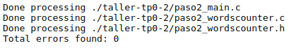

#### c)

Los errores de generación del ejecutable detectados por el SERCOM
son los siguientes:

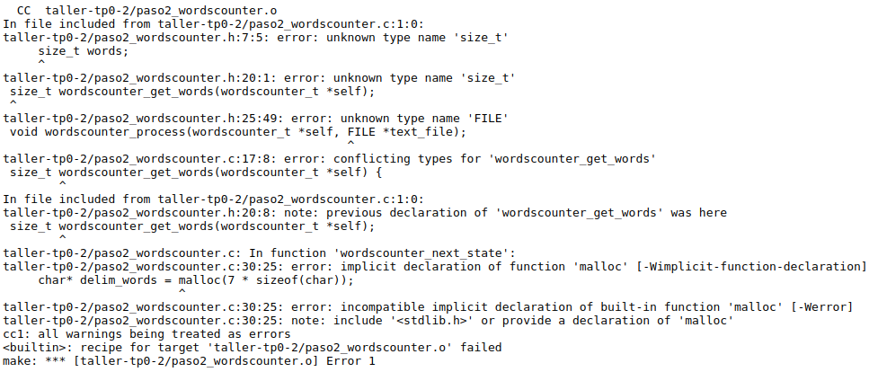

A continuación, se detalla cada uno:

Archivo *paso2_wordscounter.h*

- Línea 7. Tipo desconocido *size_t*. Para solucionarlo, debe agregarse
la instrucción *#include <string.h>*. Este archivo pertenece a la librería
estándar de C y, entre otras cosas, contiene la declaración del tipo
mencionado
- Línea 20. Ídem punto anterior
- Línea 25. Tipo desconocido *FILE*. Similar al punto anterior, pero
la instrucción faltante es *#include <stdio.h>*.

Archivo *paso2_wordscounter.c*

- Línea 1. Declaración previa de la función *wordscounter_get_words*.
En este caso, esto se da por el no reconocimiento del tipo *size_t*.
- Línea 17. Conflicto de tipos entre la declaración de la función
*wordscounter_get_words()* en el *.h* y su definición en el *.c*.
A pesar de que el tipo es el mismo (*size_t*), en el *.c* está
incluido el archivo que lo define (*string.h*), mientras que en el *.h* no.
Por este motivo, el compilador no los reconoce como un mismo tipo.
- Línea 30. Declaración implícita de la función *malloc()*. Para solucionarlo,
debe agregarse la instrucción *#include <stdlib.h>*. Este archivo pertenece
a la librería estándar de C y, entre otras cosas, contiene la declaración
de la función mencionada

Todos los errores mencionados pertenecen a la etapa de compilación.

#### Paso 3: SERCOM - Errores de generación 3

#### a)

Respecto de la versión anterior, se realizaron las siguientes correcciones:

- Se incluyó el archivo *stdlib.h* en *paso3_wordscounter.c*.
Esto soluciona la declaración implícita de la función *malloc()*.
- Se incluyeron los archivos *string.h* y *stdio.h* en *paso3_wordscounter.h*.
Esto soluciona el error de los tipos desconocidos *size_t* y *FILE*. A su vez,
en el caso del *size_t*, resuelve el conflicto de tipos de la línea 17.

#### b)

El error de generación del ejecutable detectado por el SERCOM
es el siguiente:

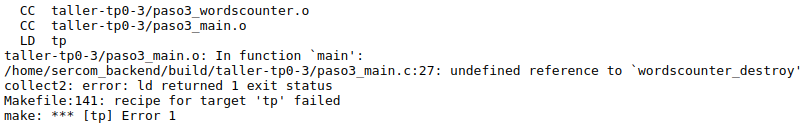

A continuación, se detalla:

Archivo *paso3_main.c*

- Línea 27. Referencia a *wordscounter_destroy()* indefinida.
A pesar de que en el *.h* se declara la función mencionada, podemos
ver que en el *.c* no se la define. El error ocurre cuando se quiere
llamar a la función, con lo cual se da en la etapa de linkedición.

### Paso 4: SERCOM - *Memory Leaks* y *Buffer Overflows*

#### a)

Respecto de la versión anterior, se realizó la siguiente corrección:

- Se definió la función *wordscounter_destroy()* en el *.c*.
Esto soluciona el error del Linker mencionado en el punto anterior

#### b)

Resultado de la ejecución con Valgrind de la prueba *TDA*:

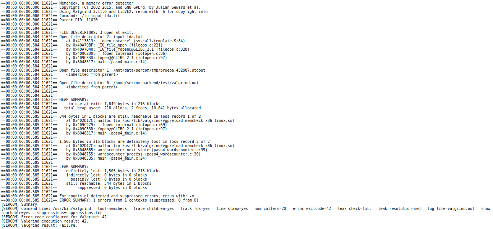

Los errores detectados por Valgrind son:

Archivo *paso4_main.c*

- Línea 14. Se abre el archivo de entrada con la función *fopen()*
pero nunca se lo cierra con *fclose()*. Como indica el mensaje, hay
344 bytes que se perderían, aunque aún son recuperables.
- Línea 24. Se invoca la función *wordscounter_process()*, la cual llama
a *wordscounter_next_state()*, dentro de la cual se reserva memoria
para los 7 delimitadores pero nunca se la libera. Eso implica una
pérdida definitiva de 1505 bytes, ya que cada vez que se sale de la función
se pierde la referencia a esa locación en memoria.

#### c)

Resultado de la ejecución con Valgrind de la prueba *Long Filename*:

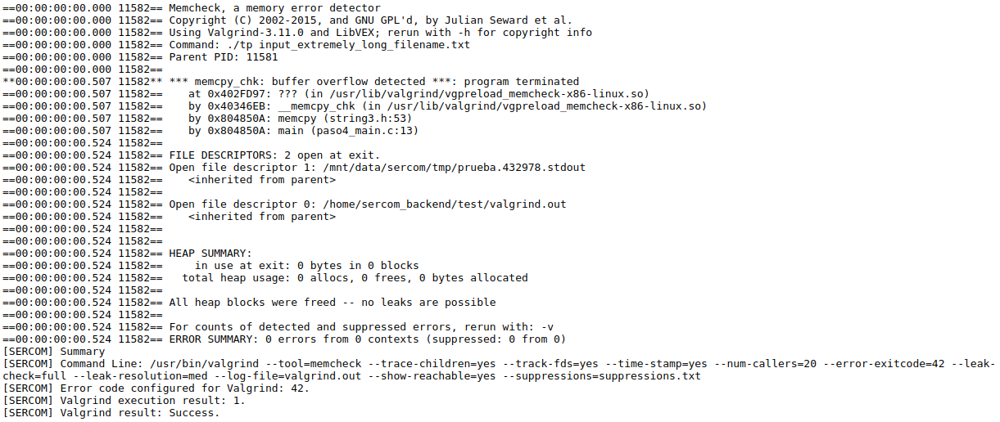

Los errores detectados por Valgrind son:

Archivo *paso4_main.c*

- Línea 13. Se detectó un *buffer overflow*. Ocurre ya que el buffer
reservado para almacenar el nombre del archivo es de 30 caracteres de largo,
pero el archivo en cuestión tiene 33 caracteres. Esto desencadena
en una escritura de memoria desconocida, no reservada para tal fin.

#### d)

Utilizar *strncpy()* en lugar de *memcpy()* no solucionaría el error.
De hecho, la ejecución de la prueba habría sido exactamente la misma.
Esto es así porque *strncpy()* copia *n* caracteres de un lugar a otro,
a menos que encuentre el carácter nulo antes, lo cual no ocurre en este caso.
Así, se copiarían 33 caracteres en un buffer de 30, generando
el mencionado *buffer overflow*.

#### e)

Un *segmentation fault* es una violación de segmento que tiene lugar
cuando se intenta acceder a un espacio en memoria para el cual
no se tienen los permisos necesarios. Por ejemplo, si se quiere escribir
una sección en memoria que es de sólo lectura.

Un *buffer overflow* es una sobrecarga del buffer que tiene lugar
cuando se supera la capacidad de un buffer y se escriben bytes de más
en un lugar de memoria desconocido. Es lo que ocurrió con *memcpy()*.
Esto puede alterar el flujo normal de un programa y tener consecuencias
inimaginables.

#### Paso 5: SERCOM - Código de retorno y salida estándar

Respecto de la versión anterior, se realizaron las siguientes correcciones:

- La ruta del archivo de entrada se lee directamente de la línea de comandos,
sin el uso intermedio de un buffer. Esto soluciona el *buffer overflow*
- En caso de abrir el archivo de entrada, se lo cierra apropiadamente.
Esto soluciona la pérdida de los 344 bytes recuperables
- Los delimitadores se almacenan en una cadena de caracteres,
ya no se reserva memoria para ellos. Esto soluciona la pérdida
definitiva de los 1505 bytes que se daba por no liberar la memoria reservada

#### b)

##### Prueba *Invalid File*

La información que entrega el SERCOM respecto al error en la prueba
*Invalid File* es la siguiente:

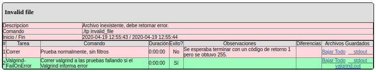

Lo que ocurre es que el programa, al no encontrar el archivo especificado,
devuelve un código de error igual a -1, cuando el SERCOM espera recibir un 1.
Esto se puede apreciar en la columna de *Observaciones*.

##### Prueba *Single Word*

La información que entrega el SERCOM respecto al error en la prueba
*Single Word* es la siguiente:

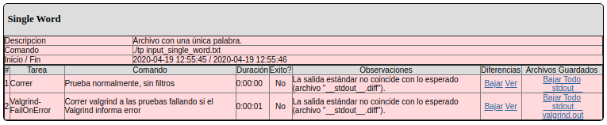

Lo que ocurre es que el valor devuelto es 0, cuando el SERCOM espera
recibir un 1 (ya que el archivo de prueba contiene una única palabra).
Esto se puede apreciar en la columna de *Observaciones*.

El error radica en que cuando se llega al último carácter de la palabra,
se compara el siguiente con *EOF (End of File)* y, de ser así,
se actualiza el estado del contador a *finalizado*, sin previamente
haber incrementado la cantidad de palabras en uno.

#### c)

A continuación, se muestra la ejecución del comando *hexdump*:

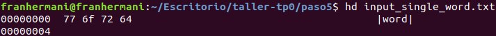

El último carácter del archivo *input_single_word.txt* es "d",
representado en hexadecimal con el número 64.

Cabe destacar que todos los archivos tienen un carácter especial
para indicar la finalización del mismo. Es conocido como *EOF (End of File)*.

#### d)

A continuación, se muestra el resultado de la ejecución con *gdb*:

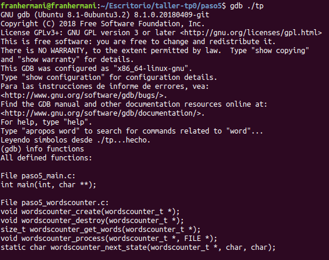
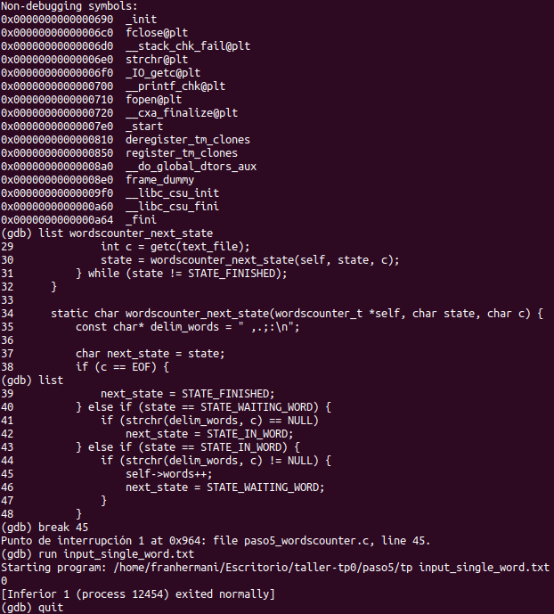

Los comandos utilizados fueron:

- *info functions*. Devuelve las funciones definidas
en los archivos analizados
- *list wordscounter_next_state*. Devuelve las 10 líneas que
se encuentran alrededor de la función recibida por parámetro
- *list*. Devuelve las 10 líneas siguientes a la última línea devuelta.
En caso de no haber utilizado ningún comando del tipo *list* anteriormente,
empieza por la primera línea del archivo
- *break 45*. Genera un punto de quiebre en la línea recibida por parámetro.
Éste se encargará de pausar la ejecución del programa en el instante previo
a la instrucción ubicada en dicha línea
- *run input_single_word.txt*. Comienza la ejecución del programa
con el archivo de entrada recibido por parámetro
- *quit*. Sale de *gdb*

El debugger no se detuvo en la línea 45 porque el flujo del programa
nunca llega a ejecutarla. De hecho, este es el motivo por el cual
falla la prueba *Single Word*: nunca se incrementa la cantidad de palabras.
El motivo de esto fue explicado en el inciso *b*.

#### Paso 6: SERCOM - Entrega exitosa

#### a)

Respecto de la versión anterior, se realizaron las siguientes correcciones:

- Se redefinió el código de error al valor esperado por el SERCOM (-1).
Gracias a esto, la prueba *Invalid File* ahora pasa con éxito
- Se definieron los delimitadores en una variable global
- Se corrigió el algoritmo propiamente dicho para que procese
adecuadamente archivos de una única palabra. Más precisamente,
la nueva condición de la línea 45 es la encargada de atrapar este caso borde,
ya que evalúa si se llega al *EOF* al estar procesando la primera palabra,
en cuyo caso incrementa la cantidad en uno.
Gracias a esto, la prueba *Single Word* ahora pasa con éxito

#### b)

A continuación, se muestran todas las entregas realizadas,
tanto exitosas como fallidas:

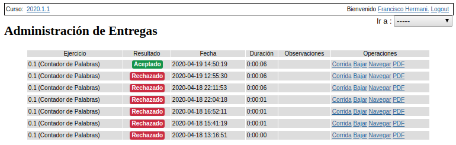

#### c)

A continuación, se muestra la ejecución de la prueba *Single Word*
de forma local, en sus tres variantes:

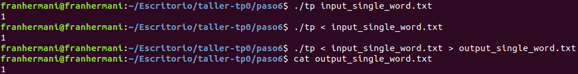
