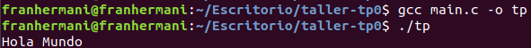
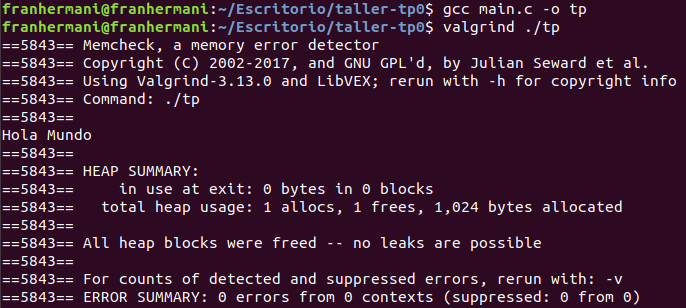

### Nombre: Francisco Hermani

### Padrón: 98223

Link GitHub: https://github.com/franhermani/taller-tp0

#### Paso 0: Entorno de trabajo

##### a)
Ejecución del aplicativo sin Valgrind

Ejecución del aplicativo con Valgrind

#### b)

Valgrind es una herramienta que permite debuggear y detectar
pérdidas y errores de memoria en un programa dado, tales como:
- Escritura en memoria de sólo lectura o ya liberada
- Uso de memoria no inicializada
- Leaks de memoria

Sus opciones más comunes son *Memcheck*, *Addrcheck* y *Helgrind*.

#### c)

El operador *sizeof()* representa el espacio en bytes que
ocupa en memoria el tipo de dato recibido por parámetro.

El valor de salida de *sizeof(char)* será de 1 byte,
mientras que el de *sizeof(int)* sera de 4 bytes.

#### d)

El *sizeof()* de un struct de C es mayor o igual a la suma
del *sizeof()* de cada uno de sus elementos.

Asumiendo que estamos trabajando en una arquitectura cuya
alineación en memoria es de N bytes, la igualdad se logrará
siempre y cuando la suma de los *sizeof()* de los elementos
del struct sea un valor múltiplo de N bytes.

En cualquier otro caso, el *sizeof()* del struct
será mayor al de la suma de sus elementos.

Por ejemplo, si estamos trabajando en una arquitectura que alinea
a 4 bytes y tenemos un struct A con 4 atributos tipo *char*,
entonces se dará la igualdad. En este caso,
*sizeof(A) = 4 * sizeof(char) = 4*

En cambio, si tenemos un struct B con un elemento tipo *char*
y otro tipo *int*, entonces no se dará la igualdad, ya que
el compilador aplicará padding para lograr la alineación mencionada.
En este caso *sizeof(B) = sizeof(char) + 3 bytes de padding + sizeof(int) = 1 + 3 + 4 = 8*,
mientras que la suma de los *sizeof()* de sus elementos es
*sizeof(char) + sizeof(int) = 1 + 4 = 5*

#### e)

A continuación, se detallan las características de los archivos estándar:

- STDIN (*Standard Input*). Entrada estándar del programa. Para redirigir la entrada
a un archivo de texto plano, utilizar la sintaxis *./tp < archivo*
- STDOUT (*Standard Output*). Salida estándar del programa. Para redirigir la salida
a un archivo de texto plano, utilizar la sintaxis *./tp > archivo*
- STDERR (*Standard Error*). Salida estándar de los errores del programa. La redirección
funciona igual que en STDOUT

Por otro lado, para conectar la salida estándar de un *programa1*
con la entrada estándar de un *programa2*, utilizar la sintaxis
*programa1 | programa2*
