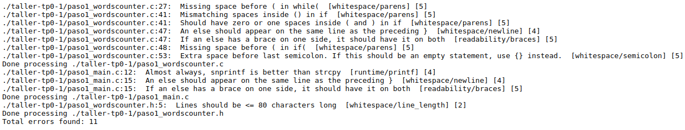

### Nombre: Francisco Hermani

### Padrón: 98223

Link GitHub: https://github.com/franhermani/taller-tp0

#### Paso 0: Entorno de trabajo

#### a)
Ejecución del aplicativo sin Valgrind

Ejecución del aplicativo con Valgrind

#### b)

Valgrind es una herramienta que permite debuggear y detectar
pérdidas y errores de memoria en un programa dado, tales como:
- Escritura en memoria de sólo lectura o ya liberada
- Uso de memoria no inicializada
- Leaks de memoria

Sus opciones más comunes son *Memcheck*, *Addrcheck* y *Helgrind*.

#### c)

El operador *sizeof()* representa el espacio en bytes que
ocupa en memoria el tipo de dato recibido por parámetro.

El valor de salida de *sizeof(char)* será de 1 byte,
mientras que el de *sizeof(int)* será de 4 bytes.

#### d)

El *sizeof()* de un struct de C es mayor o igual a la suma
del *sizeof()* de cada uno de sus elementos.

Asumiendo que estamos trabajando en una arquitectura cuya
alineación en memoria es de N bytes, la igualdad se logrará
siempre y cuando la suma de los *sizeof()* de los elementos
del struct sea un valor múltiplo de N bytes.

En cualquier otro caso, el *sizeof()* del struct
será mayor al de la suma de sus elementos.

Por ejemplo, si estamos trabajando en una arquitectura que alinea
a 4 bytes y tenemos un struct A con 4 atributos tipo *char*,
entonces se dará la igualdad. En este caso,
*sizeof(A) = 4 * sizeof(char) = 4*

En cambio, si tenemos un struct B con un elemento tipo *char*
y otro tipo *int*, entonces no se dará la igualdad, ya que
el compilador aplicará padding para lograr la alineación mencionada.
En este caso *sizeof(B) = sizeof(char) + 3 bytes de padding
+ sizeof(int) = 1 + 3 + 4 = 8*, mientras que la suma de los *sizeof()*
de sus elementos es *sizeof(char) + sizeof(int) = 1 + 4 = 5*

#### e)

A continuación, se detallan los archivos estándar:

- STDIN (*Standard Input*). Entrada estándar del programa. Para redirigir
la entrada a un archivo de texto plano, utilizar la sintaxis *./tp < archivo*
- STDOUT (*Standard Output*). Salida estándar del programa. Para redirigir
la salida a un archivo de texto plano, utilizar la sintaxis *./tp > archivo*
- STDERR (*Standard Error*). Salida estándar de los errores del programa.
La redirección funciona igual que en STDOUT

Por otro lado, para conectar la salida estándar de un *programa1*
con la entrada estándar de un *programa2*, utilizar la sintaxis
*programa1 | programa2*

#### Paso 1: SERCOM - Errores de generación y normas de programación

#### a)

Los problemas de estilo detectados por el SERCOM son los siguientes:

A continuación, se detalla cada uno:

Archivo *paso1_wordscounter.c*
- Línea 27. Falta un espacio entre el *while* y el paréntesis de la condición
- Línea 41. No coincide la cantidad de espacios al inicio y al final
de la condición del *if*. Se tienen 2 y 0 espacios, respectivamente.
- Línea 41. La cantidad de espacios al inicio y al final del *if*
no es correcta. Deberían ser 0 ó 1, y se tienen 2 al inicio y 0 al final.
- Línea 47. El *else* no está en la misma línea que la llave que cierra el *if*
- Línea 47. Las llaves del *else* no están en la misma línea (es decir,
la que cierra el *if* anterior y la que da comienzo al mismo *else*)
- Línea 48. Falta un espacio entre el *if* y el paréntesis de la condición
- Línea 53. Sobra un espacio entre el valor de retorno y el carácter ";"

Archivo *paso1_main.c*
- Línea 12. En general, se recomienda el uso de la función *snprintf()*
por sobre *strcpy()*. Esto es así ya que es más robusto y limita la cantidad
de caracteres a leer, lo cual evita posibles *buffer overflows*.
- Línea 15. El *else* no está en la misma línea que la llave que cierra el *if*
- Línea 15. Las llaves del *else* no están en la misma línea (es decir,
la que cierra el *if* anterior y la que da comienzo al mismo *else*)

Archivo *paso1_wordscounter.h*
- Línea 5. La línea supera la cantidad de caracteres máxima recomendada
por línea de código (83 > 80)

#### b)

Los errores de generación del ejecutable detectados por el SERCOM
son los siguientes:

A continuación, se detalla cada uno:

Archivo *paso1_main.c*

- Línea 22. Tipo desconocido *wordscounter_t*. Ocurre porque no se incluyó
el archivo *paso1_wordscounter.h*, en el cual se define el tipo mencionado
- Línea 23. Declaración implícita de la función *wordscounter_create*.
Ocurre porque no se incluyó el archivo *paso1_wordscounter.h*, en el cual
se declara dicha función
- Línea 24. Declaración implícita de la función *wordscounter_process*.
Ocurre por el mismo motivo que el punto anterior
- Línea 25. Declaración implícita de la función *wordscounter_get_words*.
Ocurre por el mismo motivo que el punto anterior
- Línea 27. Declaración implícita de la función *wordscounter_destroy*.
Ocurre por el mismo motivo que el punto anterior

Todos los errores mencionados pertenecen a la etapa de compilación.

#### c)

El sistema no reportó ningún *warning*. Esto se debe a que el SERCOM compila
con el flag *-Werror*, el cual implica que todos los *warnings* se traten
como *errores*.